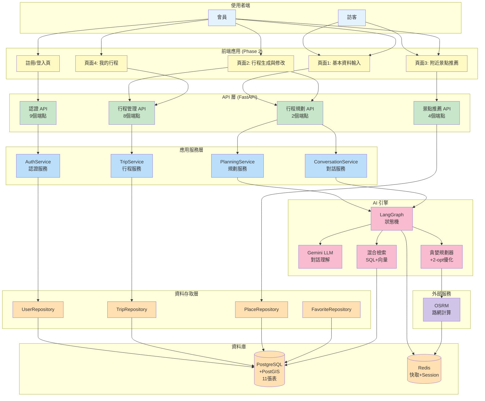
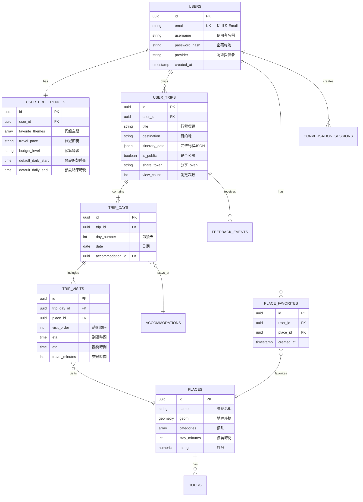
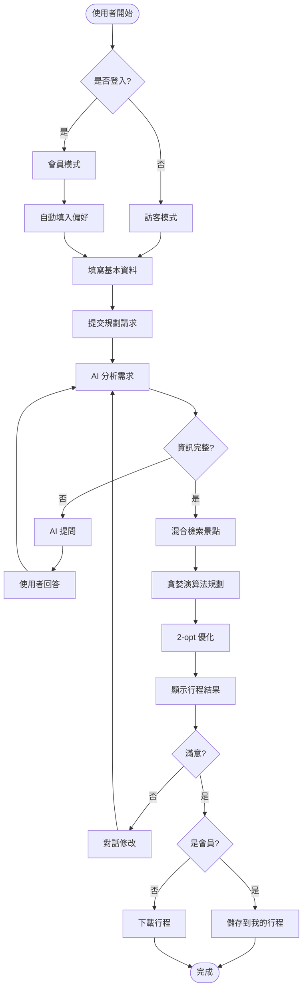
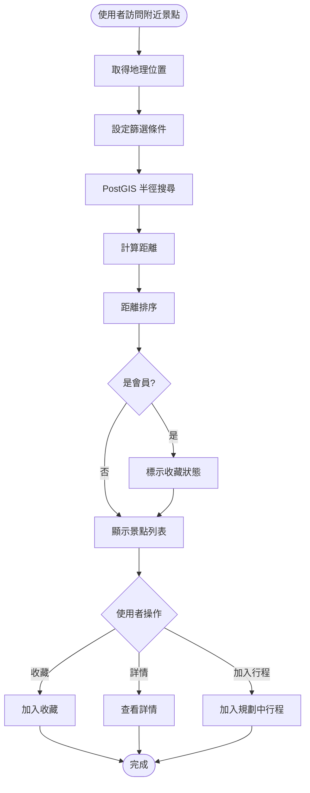
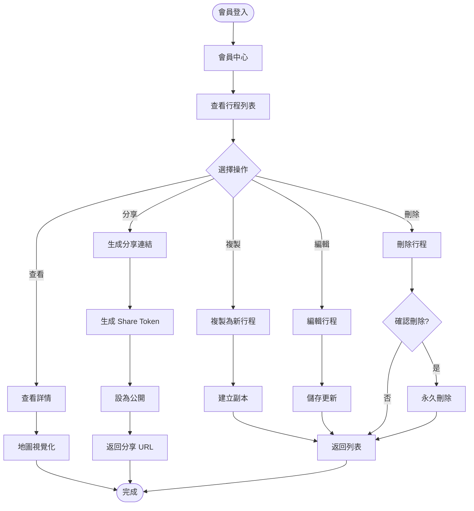
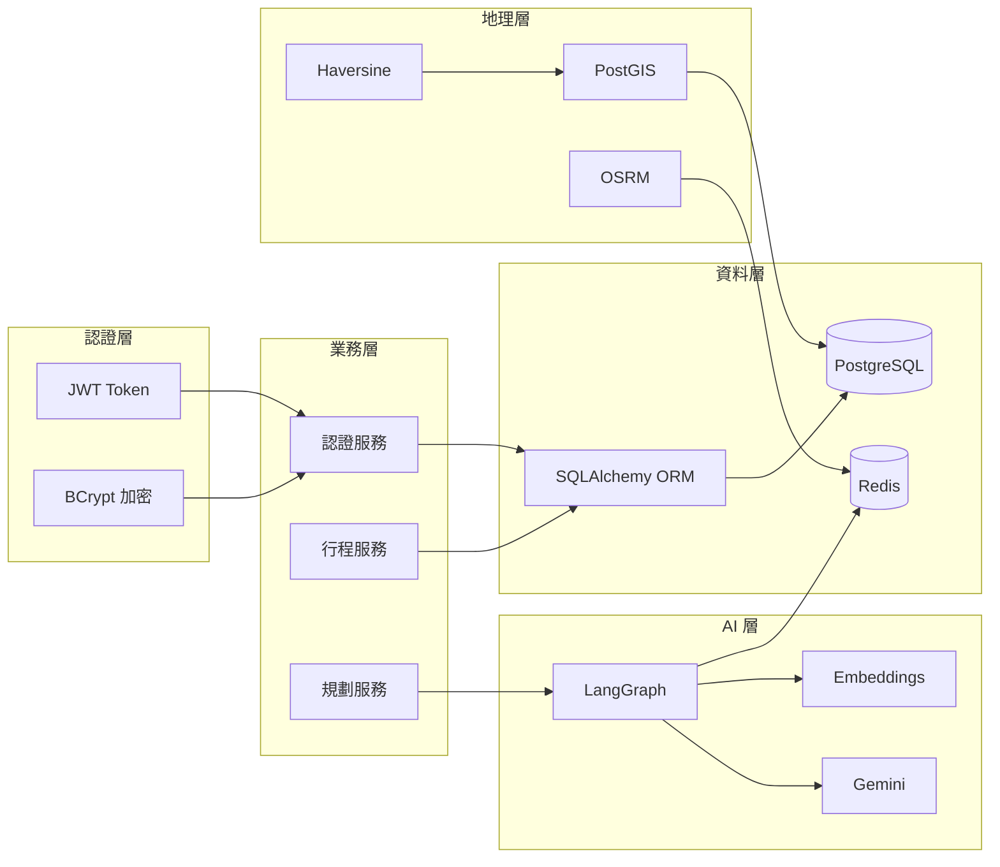
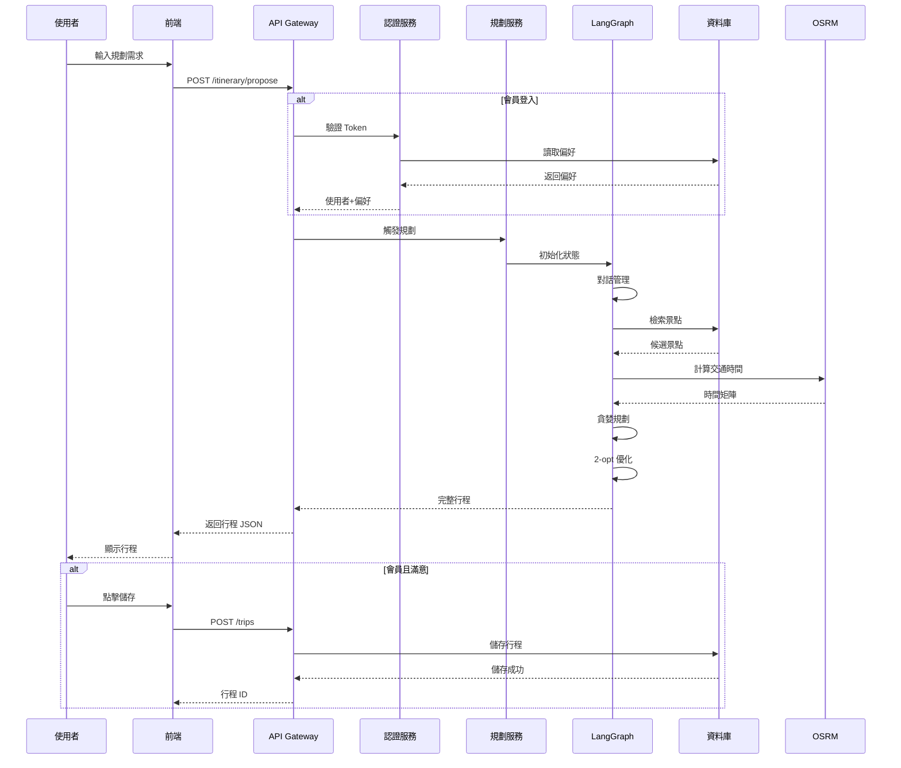
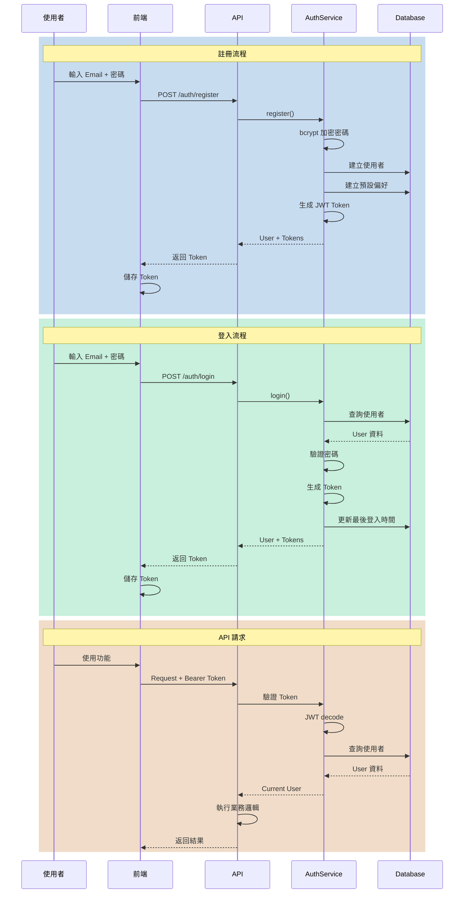
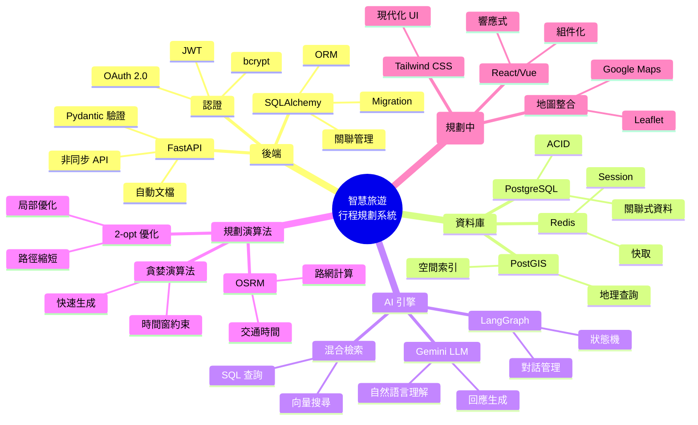

# 🏗️ 智慧旅遊行程規劃系統 - 架構總覽圖

**版本**: v2.0  
**更新日期**: 2025-09-30

---

## 📊 系統全景圖



---

## 🗄️ 資料庫架構圖



---

## 🔄 使用者流程圖

### 流程 1: 行程規劃完整流程



### 流程 2: 景點推薦流程



### 流程 3: 會員行程管理



---

## 🔑 關鍵技術整合圖



---

## 📈 系統能力矩陣

| 功能模組 | 訪客 | 會員 | 技術實作 |
|---------|------|------|---------|
| **行程規劃** | ✅ 基本規劃 | ✅ 個性化規劃 | LangGraph + Gemini |
| **行程修改** | ✅ 即時修改 | ✅ 即時修改 | 對話式 DSL |
| **行程儲存** | ❌ | ✅ 儲存至帳號 | PostgreSQL |
| **行程分享** | ❌ | ✅ 生成公開連結 | Share Token |
| **查看公開行程** | ✅ | ✅ | Token 驗證 |
| **附近景點** | ✅ 基本推薦 | ✅ 顯示收藏狀態 | PostGIS + Haversine |
| **景點收藏** | ❌ | ✅ | 收藏表 |
| **個人設定** | ❌ | ✅ | 偏好表 |

---

## 🎯 資料流向圖

### 行程規劃資料流



---

## 🔐 認證流程圖



---

## 📊 技術棧視覺化



---

## 🎨 使用者介面概念圖

### 頁面 1: 基本資料輸入

```
┌────────────────────────────────────┐
│   🗺️ 開始規劃你的完美行程          │
├────────────────────────────────────┤
│                                    │
│  📍 目的地: [宜蘭         ▼]      │
│  📅 日期:   [2025-10-01   📅]     │
│  🕐 天數:   [2 天         ▼]      │
│                                    │
│  ❤️ 興趣 (多選):                  │
│  [✓] 美食  [✓] 自然  [ ] 文化    │
│  [ ] 親子  [ ] 購物  [ ] 夜生活  │
│                                    │
│  💰 預算: (●) 中等                │
│  ⏱️ 節奏: (●) 適中                │
│                                    │
│         [生成行程 →]               │
└────────────────────────────────────┘
```

### 頁面 2: 行程結果與修改

```
┌─────────────────┬──────────────────┐
│ 📅 第 1 天      │                  │
│                 │    [地圖顯示]    │
│ 09:00-11:00     │                  │
│ 🍜 羅東夜市     │      ●           │
│ ⭐ 4.5  🚗 15min│      │           │
│                 │      ● 景點路線  │
│ 11:15-13:00     │      │           │
│ 🌳 太平山       │      ●           │
│ ⭐ 4.8  🚗 40min│                  │
│                 │                  │
│ 🏨 宜蘭民宿     │                  │
├─────────────────┴──────────────────┤
│ 💬 修改行程:                       │
│ [輸入...] [送出]  [儲存行程 ⭐]   │
└────────────────────────────────────┘
```

---

## 📚 文件導航

### 🎯 快速開始
1. [快速啟動指南](快速啟動指南.md) - 5 分鐘啟動系統
2. [快速開始-資料庫設定](快速開始-資料庫設定.md) - 資料庫初始化

### 🏗️ 架構設計
1. [系統架構設計文件](系統架構設計文件.md) - 完整系統架構
2. [行程規劃邏輯文件](行程規劃邏輯文件.md) - AI 規劃邏輯

### 🔧 開發指南
1. [認證 API 使用指南](認證API使用指南.md) - API 使用說明
2. [Migration 指引](../scripts/migrations/README.md) - 資料庫 Migration

### 📊 進度報告
1. [TODO 清單](../TODO.md) - 開發待辦
2. [Phase 1 完成報告](../PHASE1_完成報告.md) - 階段性總結

---

**繪製日期**: 2025-09-30  
**下次更新**: Phase 2 前端開發開始
