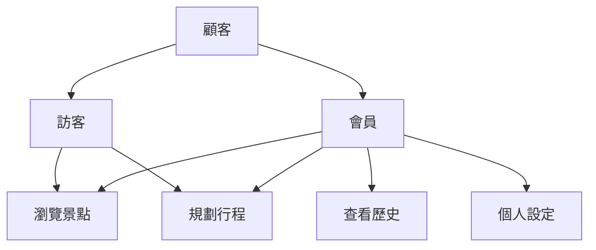
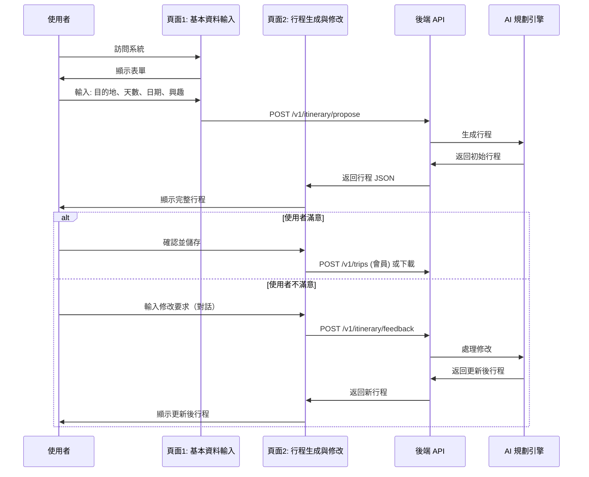
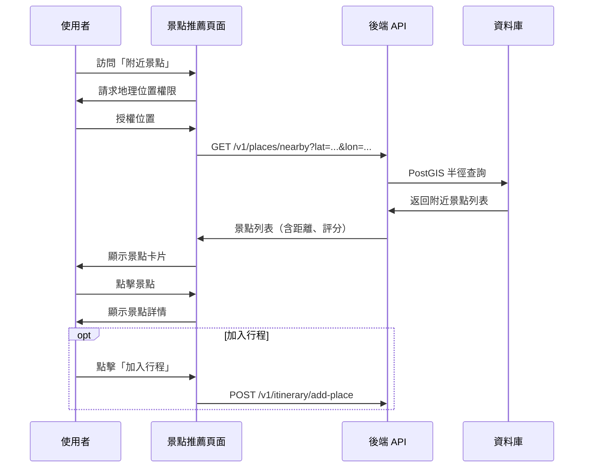
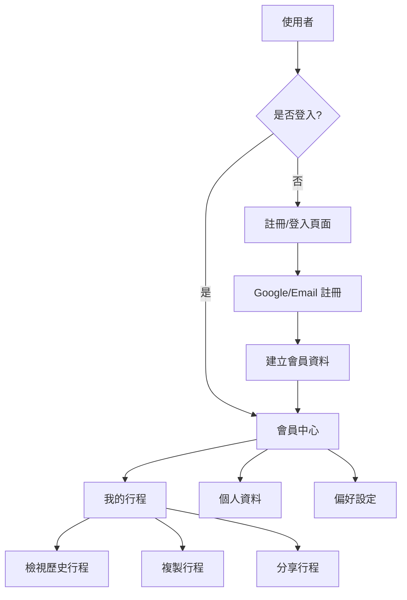
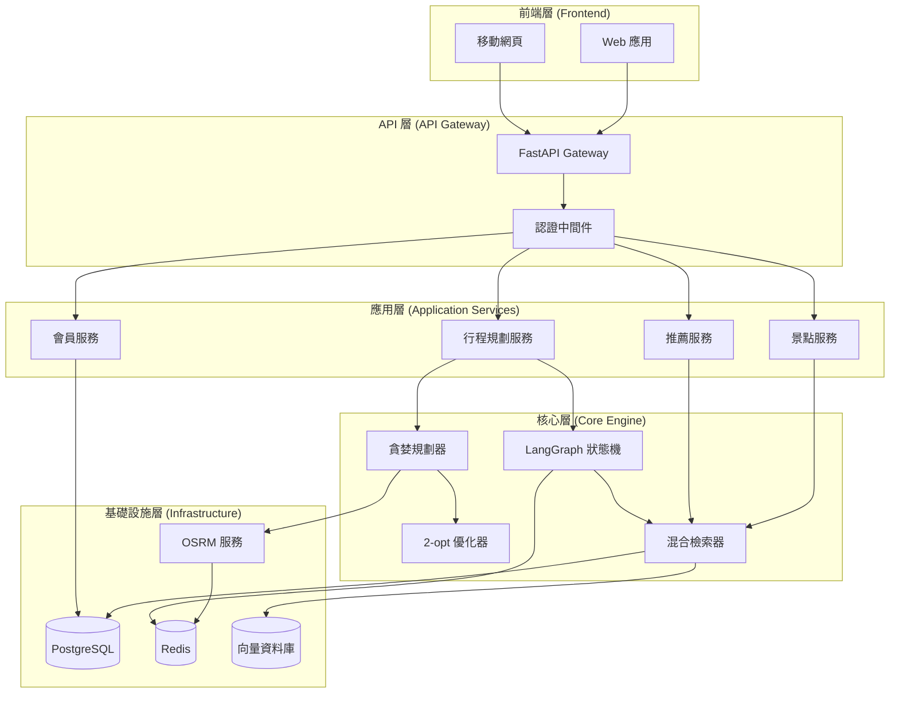
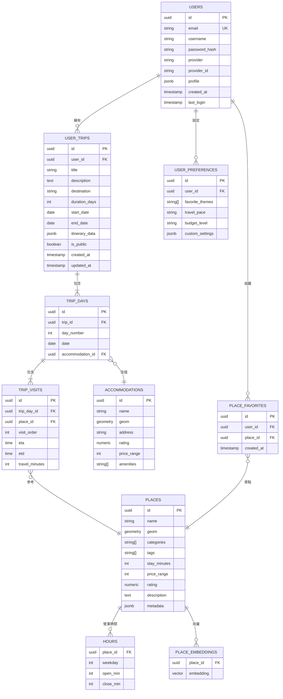
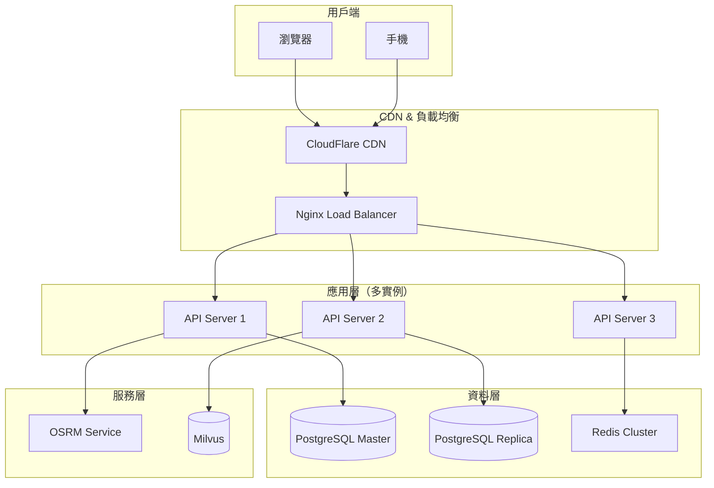

# 智慧旅遊行程規劃系統 - 完整系統架構設計

**版本**: v2.0  
**更新日期**: 2025-09-30  
**主要使用者**: 規劃行程的顧客

---

## 目錄

1. [系統概述](#1-系統概述)
2. [使用者流程設計](#2-使用者流程設計)
3. [系統架構](#3-系統架構)
4. [資料庫設計](#4-資料庫設計)
5. [API 設計](#5-api-設計)
6. [前端頁面設計](#6-前端頁面設計)
7. [功能模組設計](#7-功能模組設計)
8. [部署架構](#8-部署架構)

---

## 1. 系統概述

### 1.1 系統定位

智慧旅遊行程規劃系統是一個面向旅遊愛好者的 SaaS 平台，提供：
- **智慧行程規劃**: AI 驅動的個性化行程生成
- **景點推薦**: 基於位置的智慧景點推薦
- **會員服務**: 行程記錄、個人偏好管理

### 1.2 核心價值

- 🎯 **個性化**: 根據使用者偏好生成專屬行程
- 🤖 **智慧化**: AI 對話式互動，自然語言規劃
- 📍 **即時性**: 基於當前位置的景點推薦
- 💾 **記憶性**: 保存歷史行程，便於複用與分享

### 1.3 技術棧

| 分類 | 技術 | 說明 |
|------|------|------|
| 後端框架 | Python + FastAPI | 高性能非同步 API |
| 資料庫 | PostgreSQL + PostGIS | 地理空間查詢 |
| 快取 | Redis | 對話狀態、交通時間快取 |
| AI 引擎 | LangGraph + Gemini/OpenAI | 對話式 AI 規劃 |
| 路網計算 | OSRM | 交通時間計算 |
| 前端 | React/Vue + Tailwind CSS | 現代化響應式 UI |

---

## 2. 使用者流程設計

### 2.1 主要使用者角色



### 2.2 核心使用流程

#### 流程 1: 規劃新行程



#### 流程 2: 景點推薦



#### 流程 3: 會員系統



---

## 3. 系統架構

### 3.1 整體架構圖



### 3.2 技術架構分層

| 層級 | 職責 | 主要組件 |
|------|------|----------|
| **表現層** | 使用者介面、互動 | React/Vue 元件、Tailwind CSS |
| **API 層** | 路由、驗證、限流 | FastAPI、JWT 認證、CORS |
| **應用層** | 業務邏輯編排 | Service 類、Use Cases |
| **領域層** | 核心業務規則 | Entity、Value Object、Domain Service |
| **基礎設施層** | 資料存取、外部服務 | Repository、OSRM Client、LLM Client |

---

## 4. 資料庫設計

### 4.1 ER 圖



### 4.2 核心表結構

#### 4.2.1 使用者相關表

```sql
-- 使用者表
CREATE TABLE users (
    id UUID PRIMARY KEY DEFAULT gen_random_uuid(),
    email VARCHAR(255) UNIQUE NOT NULL,
    username VARCHAR(100),
    password_hash VARCHAR(255),  -- 密碼雜湊
    provider VARCHAR(50),  -- 'email', 'google', 'facebook'
    provider_id VARCHAR(255),  -- OAuth provider ID
    profile JSONB,  -- {avatar, phone, bio, ...}
    created_at TIMESTAMPTZ DEFAULT NOW(),
    last_login TIMESTAMPTZ,
    is_active BOOLEAN DEFAULT TRUE
);

CREATE INDEX idx_users_email ON users(email);
CREATE INDEX idx_users_provider ON users(provider, provider_id);

-- 使用者偏好設定
CREATE TABLE user_preferences (
    id UUID PRIMARY KEY DEFAULT gen_random_uuid(),
    user_id UUID REFERENCES users(id) ON DELETE CASCADE,
    favorite_themes TEXT[],  -- ['美食', '自然', '文化']
    travel_pace VARCHAR(20),  -- 'relaxed', 'moderate', 'packed'
    budget_level VARCHAR(20),  -- 'budget', 'moderate', 'luxury'
    custom_settings JSONB,  -- 其他自訂設定
    updated_at TIMESTAMPTZ DEFAULT NOW(),
    UNIQUE(user_id)
);
```

#### 4.2.2 行程相關表

```sql
-- 使用者行程記錄
CREATE TABLE user_trips (
    id UUID PRIMARY KEY DEFAULT gen_random_uuid(),
    user_id UUID REFERENCES users(id) ON DELETE CASCADE,
    title VARCHAR(255) NOT NULL,
    description TEXT,
    destination VARCHAR(255),  -- 主要目的地
    duration_days INT NOT NULL,
    start_date DATE,
    end_date DATE,
    itinerary_data JSONB NOT NULL,  -- 完整的行程 JSON
    is_public BOOLEAN DEFAULT FALSE,  -- 是否公開分享
    view_count INT DEFAULT 0,  -- 瀏覽次數
    created_at TIMESTAMPTZ DEFAULT NOW(),
    updated_at TIMESTAMPTZ DEFAULT NOW()
);

CREATE INDEX idx_user_trips_user_id ON user_trips(user_id);
CREATE INDEX idx_user_trips_created ON user_trips(created_at DESC);
CREATE INDEX idx_user_trips_public ON user_trips(is_public) WHERE is_public = TRUE;

-- 行程天數明細
CREATE TABLE trip_days (
    id UUID PRIMARY KEY DEFAULT gen_random_uuid(),
    trip_id UUID REFERENCES user_trips(id) ON DELETE CASCADE,
    day_number INT NOT NULL,  -- 第幾天
    date DATE NOT NULL,
    accommodation_id UUID REFERENCES accommodations(id),
    UNIQUE(trip_id, day_number)
);

-- 行程景點訪問記錄
CREATE TABLE trip_visits (
    id UUID PRIMARY KEY DEFAULT gen_random_uuid(),
    trip_day_id UUID REFERENCES trip_days(id) ON DELETE CASCADE,
    place_id UUID REFERENCES places(id),
    visit_order INT NOT NULL,  -- 當天的訪問順序
    eta TIME NOT NULL,  -- Estimated Time of Arrival
    etd TIME NOT NULL,  -- Estimated Time of Departure
    travel_minutes INT,  -- 到達該景點的交通時間
    notes TEXT,  -- 使用者備註
    UNIQUE(trip_day_id, visit_order)
);

CREATE INDEX idx_trip_visits_place ON trip_visits(place_id);
```

#### 4.2.3 景點相關表（已存在，補充說明）

```sql
-- 景點表（已存在）
CREATE TABLE IF NOT EXISTS places (
    id UUID PRIMARY KEY DEFAULT gen_random_uuid(),
    name TEXT NOT NULL,
    geom GEOMETRY(Point, 4326),  -- WGS84 座標
    categories TEXT[],  -- ['美食', '景點', '住宿']
    tags TEXT[],  -- ['親子', '網美', '戶外']
    stay_minutes INT DEFAULT 60,
    price_range INT,  -- 1-5
    rating NUMERIC(2,1),  -- 0.0-5.0
    description TEXT,
    address TEXT,
    phone VARCHAR(50),
    website VARCHAR(500),
    photo_urls TEXT[],
    source VARCHAR(50),  -- 'tdx', 'google', 'manual'
    source_id VARCHAR(255),
    metadata JSONB,
    created_at TIMESTAMPTZ DEFAULT NOW(),
    updated_at TIMESTAMPTZ DEFAULT NOW()
);

CREATE INDEX places_geom_idx ON places USING GIST (geom);
CREATE INDEX places_categories_idx ON places USING GIN (categories);
CREATE INDEX places_rating_idx ON places (rating DESC);

-- 使用者收藏景點
CREATE TABLE place_favorites (
    id UUID PRIMARY KEY DEFAULT gen_random_uuid(),
    user_id UUID REFERENCES users(id) ON DELETE CASCADE,
    place_id UUID REFERENCES places(id) ON DELETE CASCADE,
    created_at TIMESTAMPTZ DEFAULT NOW(),
    UNIQUE(user_id, place_id)
);

CREATE INDEX idx_favorites_user ON place_favorites(user_id);
```

#### 4.2.4 對話與回饋表

```sql
-- 對話 Session（補充）
CREATE TABLE conversation_sessions (
    id UUID PRIMARY KEY DEFAULT gen_random_uuid(),
    user_id UUID REFERENCES users(id),  -- 可為 NULL（訪客）
    session_id VARCHAR(255) UNIQUE NOT NULL,
    state_data JSONB,  -- LangGraph 狀態
    created_at TIMESTAMPTZ DEFAULT NOW(),
    updated_at TIMESTAMPTZ DEFAULT NOW(),
    expires_at TIMESTAMPTZ  -- Session 過期時間
);

CREATE INDEX idx_sessions_user ON conversation_sessions(user_id);
CREATE INDEX idx_sessions_expires ON conversation_sessions(expires_at);

-- 使用者回饋記錄（已存在，補充）
CREATE TABLE IF NOT EXISTS feedback_events (
    id BIGSERIAL PRIMARY KEY,
    session_id VARCHAR(255),
    user_id UUID REFERENCES users(id),
    trip_id UUID REFERENCES user_trips(id),
    place_id UUID,
    op VARCHAR(20),  -- 'DROP', 'REPLACE', 'MOVE', 'ADD'
    reason TEXT,
    created_at TIMESTAMPTZ DEFAULT NOW()
);
```

---

## 5. API 設計

### 5.1 API 端點總覽

#### 5.1.1 認證與會員 API

| 端點 | 方法 | 功能 | 認證 |
|------|------|------|------|
| `/v1/auth/register` | POST | 註冊新會員 | ❌ |
| `/v1/auth/login` | POST | 登入 | ❌ |
| `/v1/auth/logout` | POST | 登出 | ✅ |
| `/v1/auth/refresh` | POST | 刷新 Token | ✅ |
| `/v1/auth/oauth/google` | GET | Google OAuth | ❌ |
| `/v1/users/me` | GET | 取得當前使用者資料 | ✅ |
| `/v1/users/me` | PUT | 更新使用者資料 | ✅ |
| `/v1/users/me/preferences` | GET | 取得使用者偏好 | ✅ |
| `/v1/users/me/preferences` | PUT | 更新使用者偏好 | ✅ |

#### 5.1.2 行程規劃 API

| 端點 | 方法 | 功能 | 認證 |
|------|------|------|------|
| `/v1/itinerary/propose` | POST | 生成新行程 | ❌ |
| `/v1/itinerary/feedback` | POST | 修改行程（對話） | ❌ |
| `/v1/itinerary/optimize` | POST | 優化行程路徑 | ❌ |

#### 5.1.3 會員行程管理 API

| 端點 | 方法 | 功能 | 認證 |
|------|------|------|------|
| `/v1/trips` | GET | 取得我的行程列表 | ✅ |
| `/v1/trips` | POST | 儲存新行程 | ✅ |
| `/v1/trips/{trip_id}` | GET | 取得行程詳情 | ✅ |
| `/v1/trips/{trip_id}` | PUT | 更新行程 | ✅ |
| `/v1/trips/{trip_id}` | DELETE | 刪除行程 | ✅ |
| `/v1/trips/{trip_id}/share` | POST | 分享行程 | ✅ |
| `/v1/trips/{trip_id}/copy` | POST | 複製行程 | ✅ |
| `/v1/trips/public/{trip_id}` | GET | 查看公開行程 | ❌ |

#### 5.1.4 景點相關 API

| 端點 | 方法 | 功能 | 認證 |
|------|------|------|------|
| `/v1/places/search` | GET | 搜尋景點 | ❌ |
| `/v1/places/nearby` | GET | 附近景點推薦 | ❌ |
| `/v1/places/{place_id}` | GET | 取得景點詳情 | ❌ |
| `/v1/places/favorites` | GET | 我的收藏景點 | ✅ |
| `/v1/places/{place_id}/favorite` | POST | 收藏景點 | ✅ |
| `/v1/places/{place_id}/favorite` | DELETE | 取消收藏 | ✅ |

### 5.2 API 詳細設計範例

#### 5.2.1 註冊 API

```http
POST /v1/auth/register
Content-Type: application/json

{
  "email": "user@example.com",
  "password": "SecurePassword123",
  "username": "traveler_john"
}
```

**Response**:
```json
{
  "user": {
    "id": "550e8400-e29b-41d4-a716-446655440000",
    "email": "user@example.com",
    "username": "traveler_john",
    "created_at": "2025-09-30T10:00:00Z"
  },
  "access_token": "eyJhbGciOiJIUzI1NiIsInR5cCI6IkpXVCJ9...",
  "refresh_token": "eyJhbGciOiJIUzI1NiIsInR5cCI6IkpXVCJ9...",
  "token_type": "bearer"
}
```

#### 5.2.2 生成行程 API

```http
POST /v1/itinerary/propose
Content-Type: application/json
Authorization: Bearer <token>  (可選，會員可享個性化)

{
  "user_input": "我想在宜蘭玩兩天，喜歡美食和自然景觀",
  "session_id": "session_abc123",
  "user_id": "550e8400-e29b-41d4-a716-446655440000"  (可選)
}
```

**Response**:
```json
{
  "status": "complete",
  "itinerary": {
    "days": [
      {
        "day": 1,
        "date": "2025-10-01",
        "visits": [
          {
            "place_id": "place_001",
            "name": "羅東夜市",
            "eta": "18:00",
            "etd": "20:00",
            "travel_minutes": 0,
            "stay_minutes": 120
          }
        ],
        "accommodation": {
          "name": "宜蘭民宿",
          "address": "宜蘭縣羅東鎮..."
        }
      }
    ],
    "summary": {
      "total_days": 2,
      "total_places": 8,
      "estimated_cost": "中等"
    }
  },
  "session_id": "session_abc123"
}
```

若資訊不足：
```json
{
  "status": "need_more_info",
  "question": "請問您計畫哪一天出發呢？",
  "collected_info": {
    "destination": "宜蘭",
    "duration": 2,
    "interests": ["美食", "自然"]
  },
  "session_id": "session_abc123"
}
```

#### 5.2.3 附近景點 API

```http
GET /v1/places/nearby?lat=24.7021&lon=121.9575&radius=5000&limit=20
Authorization: Bearer <token>  (可選)
```

**Response**:
```json
{
  "places": [
    {
      "id": "place_001",
      "name": "幾米公園",
      "distance_meters": 1200,
      "distance_text": "1.2 公里",
      "categories": ["景點", "親子"],
      "rating": 4.5,
      "stay_minutes": 60,
      "price_range": 1,
      "location": {
        "lat": 24.7021,
        "lon": 121.9575
      },
      "photo_url": "https://...",
      "is_favorite": false
    }
  ],
  "total": 20,
  "user_location": {
    "lat": 24.7021,
    "lon": 121.9575
  }
}
```

#### 5.2.4 儲存行程 API

```http
POST /v1/trips
Content-Type: application/json
Authorization: Bearer <token>

{
  "title": "宜蘭兩日遊",
  "description": "美食與自然之旅",
  "destination": "宜蘭",
  "start_date": "2025-10-01",
  "end_date": "2025-10-02",
  "itinerary_data": { ... },  // 完整的行程 JSON
  "is_public": false
}
```

**Response**:
```json
{
  "trip": {
    "id": "trip_001",
    "title": "宜蘭兩日遊",
    "destination": "宜蘭",
    "duration_days": 2,
    "created_at": "2025-09-30T10:00:00Z",
    "share_url": "https://app.com/trips/public/trip_001"
  }
}
```

---

## 6. 前端頁面設計

### 6.1 頁面架構

```
首頁 (/)
├── 導覽列
│   ├── Logo
│   ├── 功能選單（規劃行程、附近景點、我的行程）
│   └── 使用者區（登入/註冊、頭像）
│
├── Hero Section
│   ├── 標題與 Slogan
│   └── CTA 按鈕：「開始規劃行程」
│
├── 功能介紹
│   ├── 智慧規劃
│   ├── 景點推薦
│   └── 行程管理
│
└── Footer
    ├── 關於我們
    ├── 隱私政策
    └── 聯絡我們
```

### 6.2 核心頁面設計

#### 6.2.1 頁面 1: 基本資料輸入

**路徑**: `/plan/start`

**設計要點**:
- 簡潔的單頁表單
- 即時驗證
- 進度指示器

**UI 組件**:

```
┌─────────────────────────────────────────────┐
│  [Logo]                      [登入] [註冊]  │
├─────────────────────────────────────────────┤
│                                             │
│     開始規劃你的完美行程 🗺️                  │
│                                             │
│  ┌─────────────────────────────────────┐   │
│  │ 目的地 *                            │   │
│  │ [宜蘭                        ▼]    │   │
│  └─────────────────────────────────────┘   │
│                                             │
│  ┌─────────────────┐  ┌─────────────────┐  │
│  │ 出發日期 *      │  │ 天數 *          │  │
│  │ [2025-10-01]    │  │ [2 天     ▼]   │  │
│  └─────────────────┘  └─────────────────┘  │
│                                             │
│  ┌─────────────────────────────────────┐   │
│  │ 旅遊興趣（可多選）*                  │   │
│  │ [X] 美食  [ ] 自然  [X] 文化        │   │
│  │ [ ] 親子  [ ] 購物  [ ] 夜生活      │   │
│  └─────────────────────────────────────┘   │
│                                             │
│  ┌─────────────────────────────────────┐   │
│  │ 預算範圍                             │   │
│  │ ( ) 經濟  (●) 中等  ( ) 豪華        │   │
│  └─────────────────────────────────────┘   │
│                                             │
│  ┌─────────────────────────────────────┐   │
│  │ 旅遊節奏                             │   │
│  │ ( ) 悠閒  (●) 適中  ( ) 緊湊        │   │
│  └─────────────────────────────────────┘   │
│                                             │
│          [生成行程 →]                       │
│                                             │
└─────────────────────────────────────────────┘
```

#### 6.2.2 頁面 2: 行程生成與修改

**路徑**: `/plan/result`

**設計要點**:
- 左側：行程時間軸顯示
- 右側：地圖視覺化
- 下方：對話修改介面

**UI 布局**:

```
┌───────────────────────────────────────────────────────────┐
│  [Logo]  我的行程                         [登入] [儲存]   │
├─────────────────────────┬─────────────────────────────────┤
│                         │                                 │
│  宜蘭兩日遊              │         [地圖視覺化]             │
│  2025-10-01 ~ 10-02     │                                 │
│                         │      ●─────●─────●              │
│  📅 第 1 天 (10/01)     │      │     │     │              │
│  ┌────────────────────┐│      景1   景2   景3             │
│  │ 09:00-11:00        ││                                 │
│  │ 🍜 羅東夜市         ││                                 │
│  │ ⭐ 4.5  💰 $$      ││                                 │
│  │ 🚗 15分鐘          ││                                 │
│  └────────────────────┘│                                 │
│  ┌────────────────────┐│                                 │
│  │ 11:15-13:00        ││                                 │
│  │ 🌳 太平山          ││                                 │
│  │ ⭐ 4.8  💰 $       ││                                 │
│  │ 🚗 40分鐘          ││                                 │
│  └────────────────────┘│                                 │
│                         │                                 │
│  🏨 住宿: 宜蘭民宿      │                                 │
│                         │                                 │
│  📅 第 2 天 (10/02)     │                                 │
│  ...                    │                                 │
│                         │                                 │
├─────────────────────────┴─────────────────────────────────┤
│  💬 對話修改行程                                           │
│  ┌────────────────────────────────────────────────────┐  │
│  │ 你: 我不想去太平山，換成海邊景點                    │  │
│  │ AI: 好的，我幫您換成外澳海灘，車程縮短為20分鐘 ✓   │  │
│  └────────────────────────────────────────────────────┘  │
│  [輸入修改需求...                               ] [送出] │
└───────────────────────────────────────────────────────────┘
```

**對話修改功能**:
- 即時修改建議
- 歷史對話記錄
- 快速操作按鈕（刪除景點、替換景點、調整時間）

#### 6.2.3 頁面 3: 附近景點推薦

**路徑**: `/places/nearby`

**設計要點**:
- 即時定位
- 地圖+列表雙視圖
- 篩選與排序

**UI 布局**:

```
┌───────────────────────────────────────────────────────────┐
│  [Logo]  附近景點                         [登入] [我的]   │
├─────────────────────────┬─────────────────────────────────┤
│                         │                                 │
│  📍 您的位置             │         [互動地圖]              │
│  宜蘭火車站              │                                 │
│                         │      📍 (您)                    │
│  🔍 篩選                │       ↓ 1.2km                   │
│  [ ] 美食               │      ● 景點1                    │
│  [X] 景點               │       ↓ 2.5km                   │
│  [ ] 購物               │      ● 景點2                    │
│                         │                                 │
│  🎯 半徑: [5km   ▼]    │                                 │
│  📊 排序: [距離  ▼]    │                                 │
│                         │                                 │
│  ──────────────────     │                                 │
│                         │                                 │
│  ┌────────────────────┐│                                 │
│  │ 📸 [圖片]          ││                                 │
│  │ 幾米公園            ││                                 │
│  │ ⭐ 4.5 (1,234)    ││                                 │
│  │ 📍 1.2 公里        ││                                 │
│  │ 💰 免費            ││                                 │
│  │ 🕐 約1小時         ││                                 │
│  │ [詳情] [收藏] [加入] │                                 │
│  └────────────────────┘│                                 │
│                         │                                 │
│  ┌────────────────────┐│                                 │
│  │ 📸 [圖片]          ││                                 │
│  │ 羅東林場            ││                                 │
│  │ ...                ││                                 │
│  └────────────────────┘│                                 │
│                         │                                 │
└─────────────────────────┴─────────────────────────────────┘
```

#### 6.2.4 頁面 4: 我的行程（會員）

**路徑**: `/trips`

**UI 布局**:

```
┌───────────────────────────────────────────────────────────┐
│  [Logo]  我的行程                  [使用者頭像 ▼]         │
├───────────────────────────────────────────────────────────┤
│                                                           │
│  我的行程 (3)                    [+ 建立新行程]           │
│                                                           │
│  ┌─────────────────────────────────────────────────────┐ │
│  │ 📸 [封面圖]       宜蘭兩日遊                        │ │
│  │                   2025-10-01 ~ 10-02               │ │
│  │                   宜蘭 • 2天 • 8個景點              │ │
│  │                                                     │ │
│  │                   [檢視] [編輯] [分享] [刪除]      │ │
│  └─────────────────────────────────────────────────────┘ │
│                                                           │
│  ┌─────────────────────────────────────────────────────┐ │
│  │ 📸 [封面圖]       台北三日遊                        │ │
│  │                   2025-09-15 ~ 09-17               │ │
│  │                   台北 • 3天 • 12個景點             │ │
│  │                                                     │ │
│  │                   [檢視] [編輯] [分享] [刪除]      │ │
│  └─────────────────────────────────────────────────────┘ │
│                                                           │
└───────────────────────────────────────────────────────────┘
```

---

## 7. 功能模組設計

### 7.1 會員認證模組

**職責**: 處理使用者註冊、登入、OAuth、權限管理

**技術實作**:
- JWT Token 認證
- OAuth 2.0 (Google, Facebook)
- 密碼加密 (bcrypt)
- Session 管理 (Redis)

**核心類別**:

```python
# src/itinerary_planner/application/services/auth_service.py

class AuthService:
    def register_user(
        self, 
        email: str, 
        password: str, 
        username: str
    ) -> User:
        """註冊新使用者"""
        pass
    
    def login(
        self, 
        email: str, 
        password: str
    ) -> AuthToken:
        """登入並返回 Token"""
        pass
    
    def verify_token(
        self, 
        token: str
    ) -> User:
        """驗證 JWT Token"""
        pass
    
    def oauth_login(
        self, 
        provider: str, 
        oauth_token: str
    ) -> AuthToken:
        """OAuth 登入"""
        pass
```

### 7.2 行程管理模組

**職責**: 會員行程的 CRUD、分享、複製

**核心類別**:

```python
# src/itinerary_planner/application/services/trip_service.py

class TripService:
    def create_trip(
        self, 
        user_id: str, 
        trip_data: TripCreateRequest
    ) -> Trip:
        """建立新行程"""
        pass
    
    def get_user_trips(
        self, 
        user_id: str, 
        skip: int = 0, 
        limit: int = 10
    ) -> List[Trip]:
        """取得使用者的行程列表"""
        pass
    
    def update_trip(
        self, 
        trip_id: str, 
        user_id: str, 
        updates: TripUpdateRequest
    ) -> Trip:
        """更新行程"""
        pass
    
    def share_trip(
        self, 
        trip_id: str, 
        user_id: str
    ) -> str:
        """分享行程，返回公開連結"""
        pass
    
    def copy_trip(
        self, 
        trip_id: str, 
        user_id: str
    ) -> Trip:
        """複製行程"""
        pass
```

### 7.3 景點推薦模組

**職責**: 基於位置、興趣、行為的景點推薦

**推薦策略**:

1. **基於位置**:
   - PostGIS 半徑查詢
   - 距離排序

2. **基於興趣**:
   - 使用者偏好匹配
   - 類別過濾

3. **基於行為**（未來擴展）:
   - 協同過濾
   - 熱門景點

**核心類別**:

```python
# src/itinerary_planner/application/services/recommendation_service.py

class RecommendationService:
    def get_nearby_places(
        self, 
        lat: float, 
        lon: float, 
        radius: int = 5000,
        categories: List[str] = None,
        user_id: str = None  # 可選，會員可享個性化
    ) -> List[Place]:
        """取得附近景點"""
        pass
    
    def get_personalized_recommendations(
        self, 
        user_id: str, 
        location: Optional[Tuple[float, float]] = None
    ) -> List[Place]:
        """個性化推薦"""
        pass
```

### 7.4 對話狀態管理模組（整合現有）

**職責**: 管理 LangGraph 對話狀態、Session 管理

**Session 持久化**:
- Redis: 短期 Session（1小時）
- PostgreSQL: 長期對話記錄

---

## 8. 部署架構

### 8.1 容器化部署

**Docker Compose 服務**:

```yaml
version: '3.8'

services:
  # 後端 API
  api:
    build: .
    ports:
      - "8000:8000"
    environment:
      - DATABASE_URL=postgresql://user:pass@db:5432/itinerary
      - REDIS_URL=redis://redis:6379
      - JWT_SECRET=${JWT_SECRET}
    depends_on:
      - db
      - redis
      - osrm
  
  # PostgreSQL + PostGIS
  db:
    image: postgis/postgis:14-3.3
    volumes:
      - postgres_data:/var/lib/postgresql/data
    environment:
      - POSTGRES_USER=user
      - POSTGRES_PASSWORD=pass
      - POSTGRES_DB=itinerary
  
  # Redis
  redis:
    image: redis:7-alpine
    volumes:
      - redis_data:/data
  
  # OSRM
  osrm:
    image: osrm/osrm-backend
    volumes:
      - ./data/osrm:/data
    command: osrm-routed --algorithm mld /data/taiwan.osrm
  
  # 前端（Nginx）
  frontend:
    image: nginx:alpine
    volumes:
      - ./frontend/dist:/usr/share/nginx/html
    ports:
      - "80:80"
    depends_on:
      - api

volumes:
  postgres_data:
  redis_data:
```

### 8.2 生產環境架構



### 8.3 監控與日誌

**監控指標**:
- API 回應時間、錯誤率
- 資料庫查詢效能
- Redis 快取命中率
- 使用者註冊、活躍度

**工具**:
- Prometheus + Grafana（指標）
- ELK Stack（日誌）
- Sentry（錯誤追蹤）

---

## 9. 開發路線圖

### Phase 1: MVP（4週）
- ✅ 基礎行程規劃 API
- ✅ 對話式修改
- ✅ 景點資料庫
- 🔲 會員系統（註冊、登入）
- 🔲 行程儲存功能
- 🔲 基本前端頁面

### Phase 2: 增強功能（4週）
- 🔲 附近景點推薦
- 🔲 景點收藏
- 🔲 行程分享
- 🔲 個性化推薦
- 🔲 地圖視覺化

### Phase 3: 優化與擴展（持續）
- 🔲 協同過濾推薦
- 🔲 社交功能（行程討論）
- 🔲 多語言支援
- 🔲 移動 App

---

## 10. 安全性考量

### 10.1 認證與授權
- JWT Token with 過期機制
- HTTPS Only
- CORS 政策
- Rate Limiting

### 10.2 資料安全
- 密碼 bcrypt 加密
- 敏感資料欄位加密（JSONB）
- SQL Injection 防護（ORM）
- XSS 防護（前端輸入驗證）

### 10.3 隱私保護
- GDPR 合規
- 資料匿名化選項
- 使用者資料匯出/刪除

---

## 總結

本系統架構設計涵蓋了：

1. ✅ **完整的使用者流程**: 從輸入資料 → 生成行程 → 對話修改 → 儲存管理
2. ✅ **景點推薦功能**: 基於位置、興趣的智慧推薦
3. ✅ **會員系統**: 完整的認證、行程管理、個人化體驗
4. ✅ **擴展性**: 模組化設計，便於未來功能擴展
5. ✅ **技術完整性**: 從前端到後端、資料庫到部署的全方位設計

下一步可以開始實作會員系統的核心功能。
